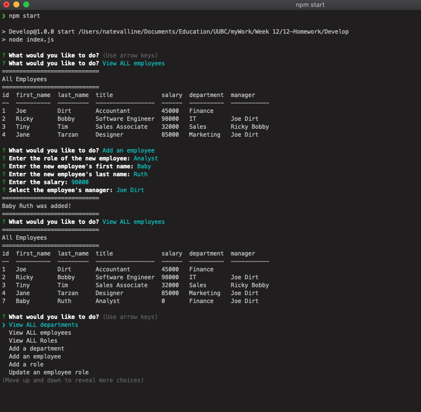

## Project Name

# Employee Tracker

> This command line interface allows the user to view/add/update & delete department, employee roles & employees.

#### [View The Site](#) - The project is not live.

---

### Table of Contents

- [Description](#description)
- [Technologies](#technologies)
- [Installation](#installation)
- [How To Use](#how-to-use)
- [Test(s)](#tests)
- [Contributors](#contributors)
- [Questions](#questions)
- [License](#license)

---

## Description

This command line interface utilizes node.js and mysql to provide the user with an application to create/view/update & delete department, employee roles & employees.  

The node interface provides a smooth user experience as it prompts the user through the different functionalities.  

By utilizing mysql, this application is able to store and retrieve data quickly and accurately.  

[Back To The Top](#project-name)

---

## Technologies

 

- Javascript, node.js, MYSQL

[Back To The Top](#project-name)

---

## Installation

Download the source files to the desired project directory. Open the terminal and navigate to the directory in the last step. Simply enter 'npm install', to install the necessary dependencies.

### [Video Walkthrough](#)

#### [View The Site](#) - The project is not live.

[Back To The Top](#project-name)

---

## How To Use

Once the dependencies are installed, simply open the terminal and enter 'npm start'. This will launch the application. Follow the prompts that are presented in the terminal. Use the 'Enter/Return' key to submit the response to each prompt.

### [Video Walkthrough](#)

[Back To The Top](#project-name)

---

## Tests

There are no tests.

[Back To The Top](#project-name)

---

## Contributors

- Nate Valline

[Back To The Top](#project-name)

---

## Questions

Please contact the following for any questions.

  =>  contact@natevalline.com

[Back To The Top](#project-name)

---

## License

MIT License

Copyright (c) 2020 Nate Valline

Permission is hereby granted, free of charge, to any person obtaining a copy
of this software and associated documentation files (the "Software"), to deal
in the Software without restriction, including without limitation the rights
to use, copy, modify, merge, publish, distribute, sublicense, and/or sell
copies of the Software, and to permit persons to whom the Software is
furnished to do so, subject to the following conditions:

The above copyright notice and this permission notice shall be included in all
copies or substantial portions of the Software.

THE SOFTWARE IS PROVIDED "AS IS", WITHOUT WARRANTY OF ANY KIND, EXPRESS OR
IMPLIED, INCLUDING BUT NOT LIMITED TO THE WARRANTIES OF MERCHANTABILITY,
FITNESS FOR A PARTICULAR PURPOSE AND NONINFRINGEMENT. IN NO EVENT SHALL THE
AUTHORS OR COPYRIGHT HOLDERS BE LIABLE FOR ANY CLAIM, DAMAGES OR OTHER
LIABILITY, WHETHER IN AN ACTION OF CONTRACT, TORT OR OTHERWISE, ARISING FROM,
OUT OF OR IN CONNECTION WITH THE SOFTWARE OR THE USE OR OTHER DEALINGS IN THE
SOFTWARE.

[Back To The Top](#project-name)

---
    